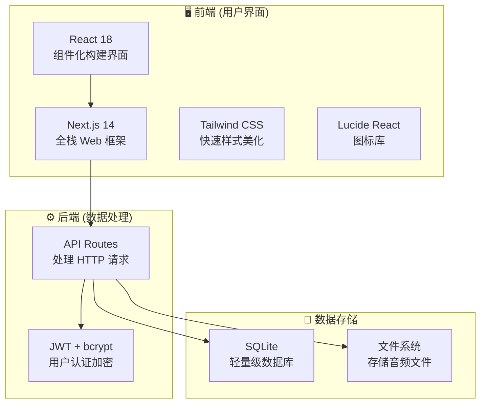
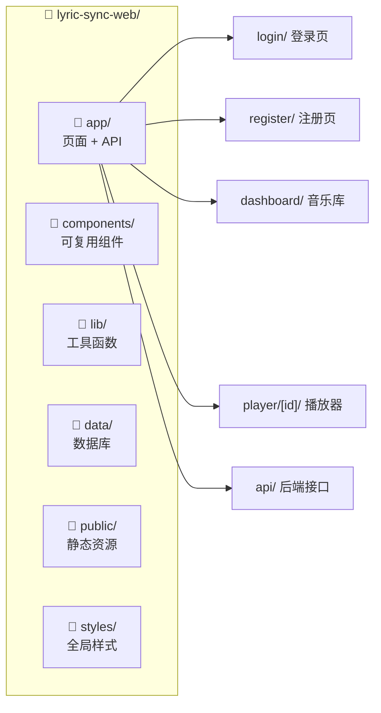
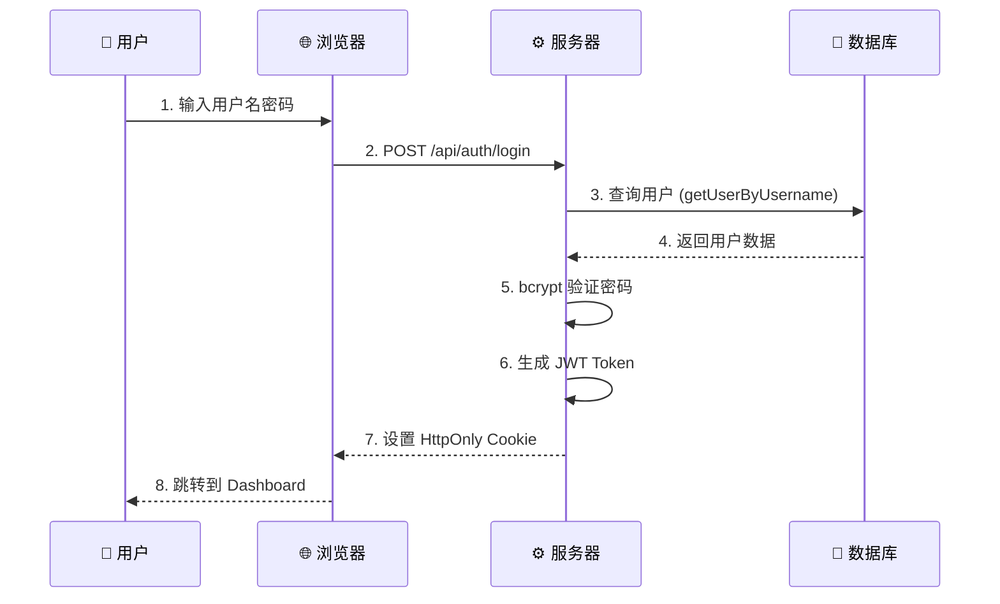
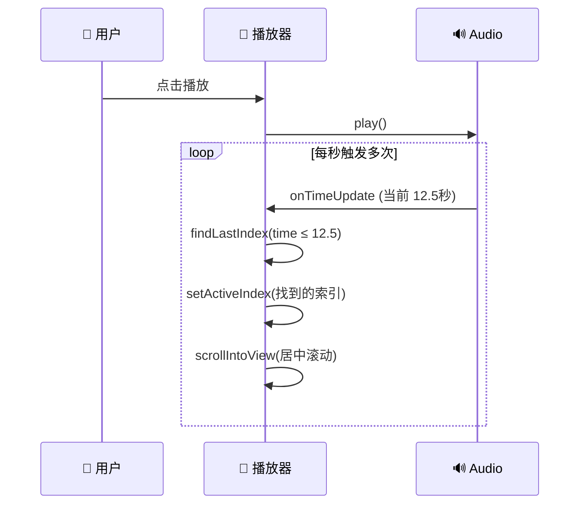
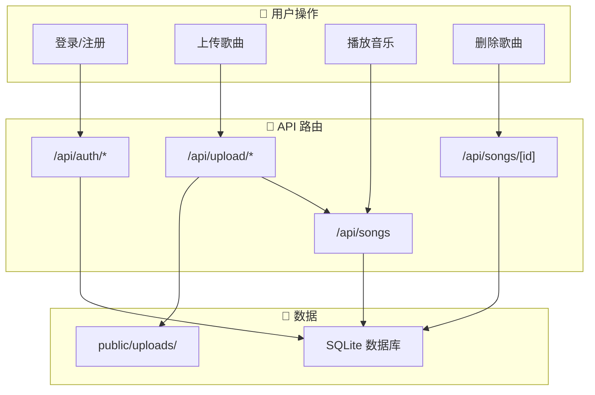
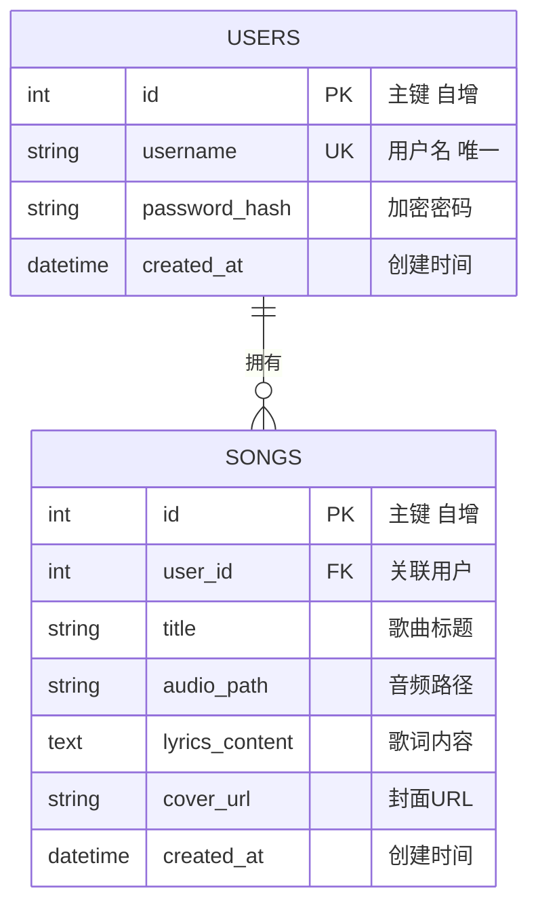
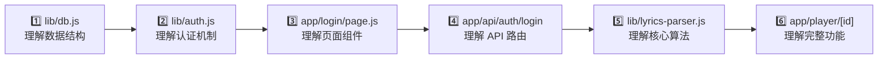

# 🎵 Lyric Sync Web 零基础入门指南

> 专为**零基础新手**准备的完整项目讲解，包含图解和代码详解。

---

## 📌 项目简介

**Lyric Sync Web** 是一个**在线音乐播放器**，核心特色：
- 🎤 **歌词同步** - 像 KTV 一样，歌词跟着音乐滚动高亮
- 📤 **上传歌曲** - 上传 MP3 和歌词文件到云端
- 👤 **用户系统** - 每人只能看到自己的歌曲

简单理解：**带歌词同步功能的私人音乐云盘**。

---

## 🧱 技术栈图解



### 技术选型说明

| 技术             | 作用         | 比喻                     |
| :--------------- | :----------- | :----------------------- |
| **React**        | 构建用户界面 | 像拼乐高一样搭建网页     |
| **Next.js**      | 全栈框架     | 房子的框架结构           |
| **Tailwind CSS** | CSS 样式     | 给房子装修刷漆           |
| **SQLite**       | 存储数据     | 记事本，存用户和歌曲信息 |
| **JWT**          | 用户认证     | 门禁卡，验证身份         |
| **bcrypt**       | 密码加密     | 保险箱，保护密码安全     |

---

## 📁 项目结构图解



### 核心文件详解

| 文件路径                  | 功能         | 代码行数 |
| :------------------------ | :----------- | :------- |
| `app/login/page.js`       | 登录页面     | ~140 行  |
| `app/dashboard/page.js`   | 歌曲管理页   | ~580 行  |
| `app/player/[id]/page.js` | 播放器页面 ⭐ | ~1900 行 |
| `lib/db.js`               | 数据库操作   | ~100 行  |
| `lib/auth.js`             | 认证工具     | ~75 行   |
| `lib/lyrics-parser.js`    | 歌词解析     | ~64 行   |

---

## 🔄 核心流程图解

### 1️⃣ 用户登录流程



**关键代码** (`app/api/auth/login/route.js`):
```javascript
// 1. 接收用户名密码
const { username, password } = await request.json();

// 2. 查询数据库
const user = getUserByUsername(username);

// 3. 验证密码 (bcrypt 比对加密后的密码)
const isValid = await verifyPassword(password, user.password_hash);

// 4. 生成令牌并存入 Cookie
const token = createToken(user.id);
await setAuthCookie(token);
```

---

### 2️⃣ 歌词同步播放流程



**关键代码** (`app/player/[id]/page.js`):
```javascript
// 1. 监听音频时间更新
<audio onTimeUpdate={() => setCurrentTime(audioRef.current.currentTime)} />

// 2. 查找当前歌词 (找最后一句 time <= currentTime 的)
const index = lyrics.findLastIndex(item => item.time <= currentTime);
setActiveIndex(index);

// 3. 自动滚动到中央
lyricRefs.current[activeIndex].scrollIntoView({
    behavior: 'smooth',
    block: 'center'  // 关键：居中显示
});
```

---

### 3️⃣ 数据流向总览



---

## 🗃️ 数据库结构



**关键代码** (`lib/db.js`):
```javascript
// 创建表 (应用启动时自动执行)
db.exec(`
  CREATE TABLE IF NOT EXISTS users (
    id INTEGER PRIMARY KEY AUTOINCREMENT,
    username TEXT UNIQUE NOT NULL,
    password_hash TEXT NOT NULL
  );
  
  CREATE TABLE IF NOT EXISTS songs (
    id INTEGER PRIMARY KEY AUTOINCREMENT,
    user_id INTEGER NOT NULL,
    title TEXT NOT NULL,
    audio_path TEXT NOT NULL,
    lyrics_content TEXT,
    FOREIGN KEY (user_id) REFERENCES users(id)
  );
`);
```

---

## 🎯 核心代码逻辑详解

### 1. 歌词解析器 (`lib/lyrics-parser.js`)

**目标**: 将文本歌词 → 程序可用的数组

```
输入: "[00:12.34]Hello World"
输出: { time: 12.34, text: "Hello World" }
```

**实现原理**:
```javascript
// 正则表达式匹配时间标签 [分:秒.毫秒]
const lrcRegex = /\[(\d{2}):(\d{2})[.:](\\d{2,3})\]/;
// \d{2} = 两位数字

// 时间转换为总秒数
const time = minute * 60 + second + (millisecond / 1000);
// 例: 00:12.34 → 0*60 + 12 + 0.34 = 12.34 秒
```

### 2. 用户认证 (`lib/auth.js`)

**密码加密流程**:
```
注册: "123456" → bcrypt.hash() → "$2a$12$R9h..."
登录: "123456" → bcrypt.compare("$2a$12$R9h...") → true/false
```

**JWT 令牌机制**:
```javascript
// 登录成功后创建令牌
jwt.sign({ userId: 123 }, SECRET_KEY, { expiresIn: '7d' });
// 返回: "eyJhbGciOiJIUzI1NiIs..." (加密字符串)

// 验证令牌
jwt.verify(token, SECRET_KEY);
// 返回: { userId: 123 } (解密后的数据)
```

### 3. SQL 注入防护 (`lib/db.js`)

```javascript
// ❌ 危险写法 (字符串拼接)
db.exec(`SELECT * FROM users WHERE username = '${username}'`);
// 如果 username = "admin' --"，会导致 SQL 注入

// ✅ 安全写法 (参数化查询)
const stmt = db.prepare('SELECT * FROM users WHERE username = ?');
stmt.get(username);  // ? 会被安全转义
```

---

## 🎹 播放器功能详解

播放器页面 (`app/player/[id]/page.js`) 是最复杂的组件，包含：

### 功能列表

| 功能       | 实现方式                               |
| :--------- | :------------------------------------- |
| 播放/暂停  | `audioRef.current.play()` / `.pause()` |
| 进度控制   | 拖拽进度条 + `currentTime` 设置        |
| 音量控制   | `audioRef.current.volume = 0.8`        |
| 单曲循环   | `onEnded` 事件 → `currentTime = 0`     |
| 播放速度   | `audioRef.current.playbackRate = 1.5`  |
| 歌词同步   | `findLastIndex` 算法                   |
| 沉浸模式   | 全屏歌词 + 背景模糊                    |
| 键盘快捷键 | `Space`=播放, `←/→`=跳转, `M`=静音     |

### 状态管理

```javascript
// 播放器核心状态
const [isPlaying, setIsPlaying] = useState(false);    // 是否播放中
const [currentTime, setCurrentTime] = useState(0);    // 当前时间
const [activeIndex, setActiveIndex] = useState(-1);   // 当前歌词索引
const [volume, setVolume] = useState(0.8);            // 音量 0-1
const [repeatMode, setRepeatMode] = useState('off');  // 循环模式
```

---

## 🚀 如何运行项目

```bash
# 1. 安装依赖
npm install

# 2. 启动开发服务器
npm run dev

# 3. 浏览器访问
http://localhost:3000
```

---

## 💡 新手学习路线



### 调试技巧

| 位置     | 方法                                  |
| :------- | :------------------------------------ |
| 前端     | 浏览器 F12 → Console 看 `console.log` |
| 后端 API | VS Code 终端查看输出                  |
| 数据库   | 用 DataGrip 连接 `data/lyric-sync.db` |

### 重要概念

1. **`'use client'`** - 标记组件在浏览器运行（可以用 useState、事件）
2. **API Routes** - `app/api/` 下的文件自动变成 HTTP 接口
3. **动态路由** - `[id]` 文件夹表示参数，如 `/player/123`

---

## ❓ 常见问题

**Q: 为什么用 SQLite？**  
A: 无需安装数据库软件，一个 `.db` 文件就是整个数据库，适合学习和小项目。

**Q: JWT 存在哪里？**  
A: 存在 `HttpOnly Cookie` 中，JavaScript 无法读取（防 XSS 攻击），但请求时浏览器会自动带上。

**Q: 支持哪些歌词格式？**  
A: LRC、SRT、VTT 格式，核心是识别时间标签如 `[00:12.34]` 或 `00:00:12,340 --> 00:00:15,000`。

---

> 📚 更多参考文档：
> - [架构分析报告](ARCHITECTURE_ANALYSIS.md)
> - [代码逻辑详解](CODE_LOGIC_EXPLAINER.md)
