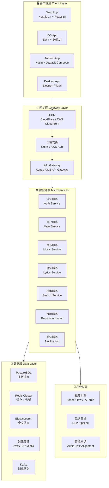
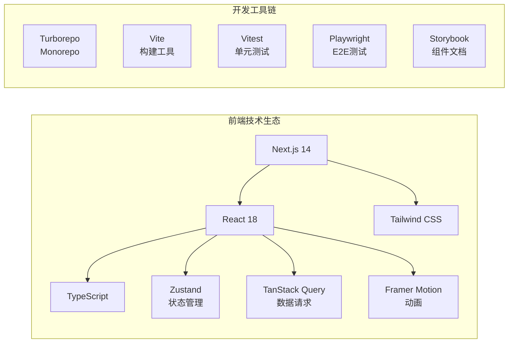
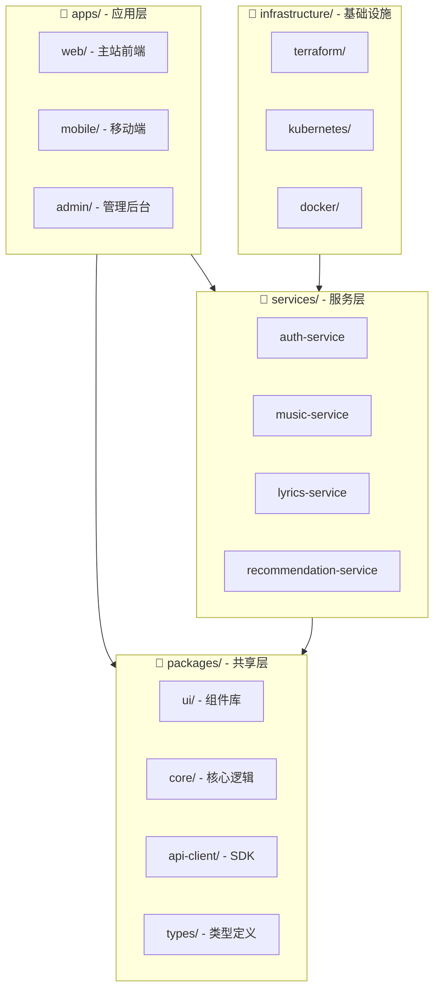
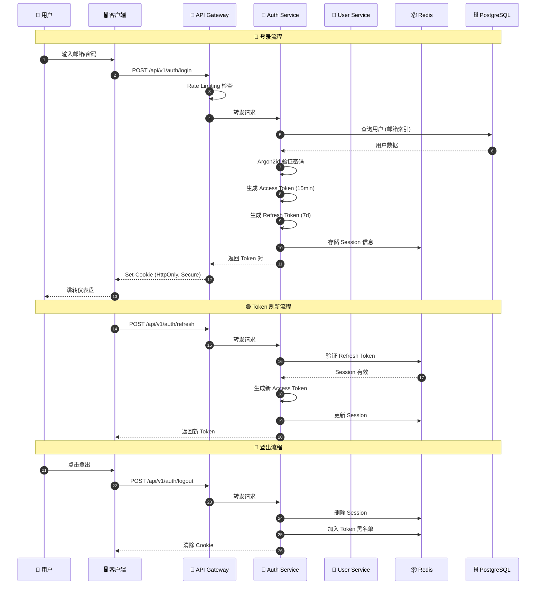
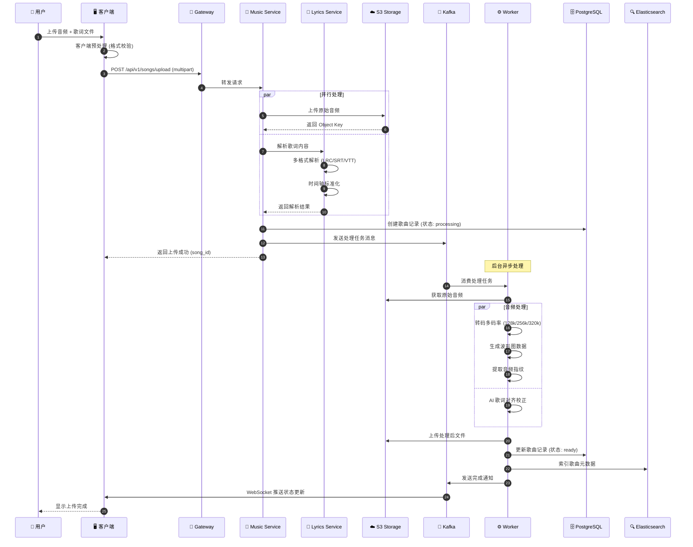
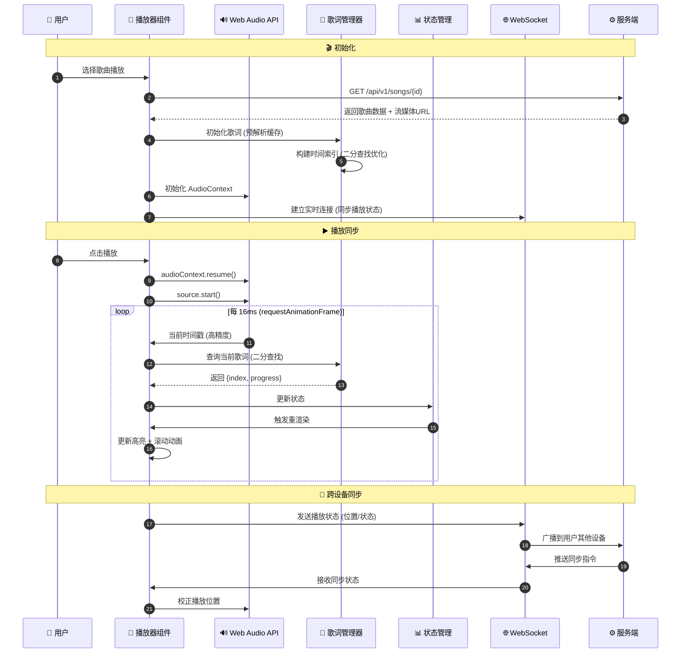
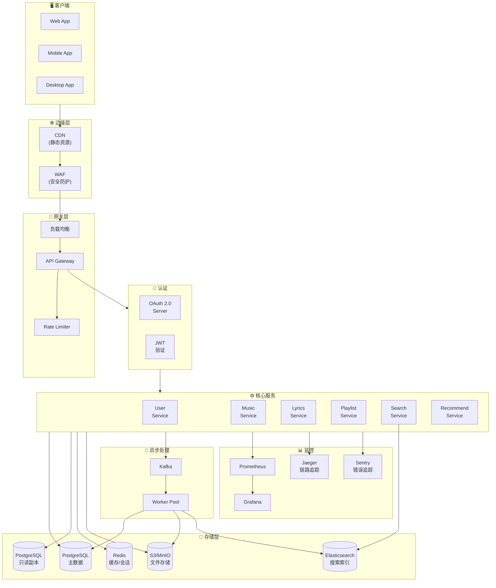
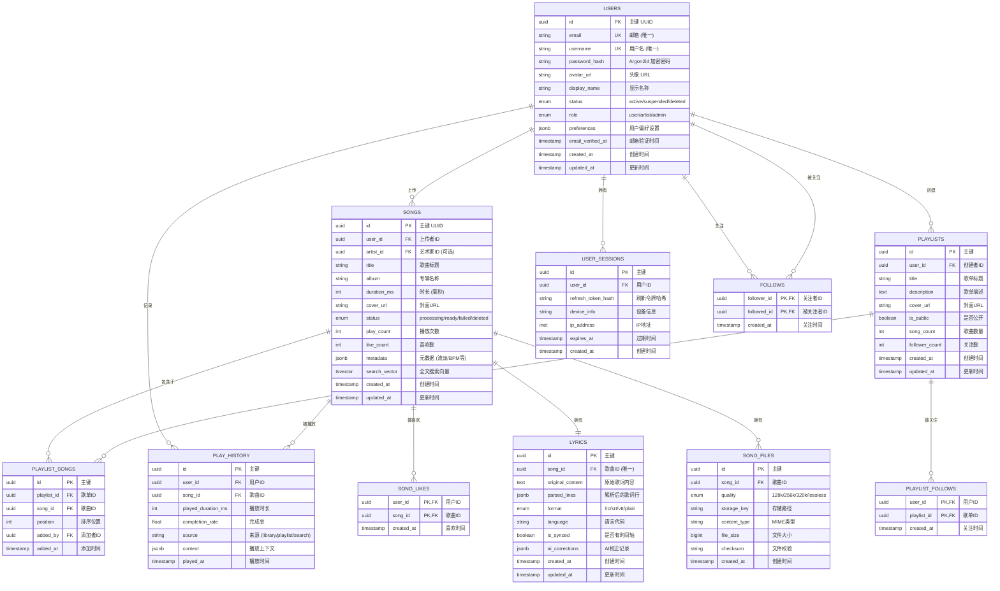
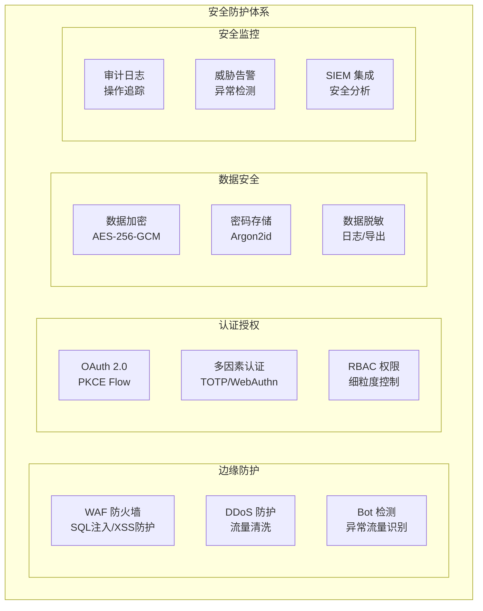
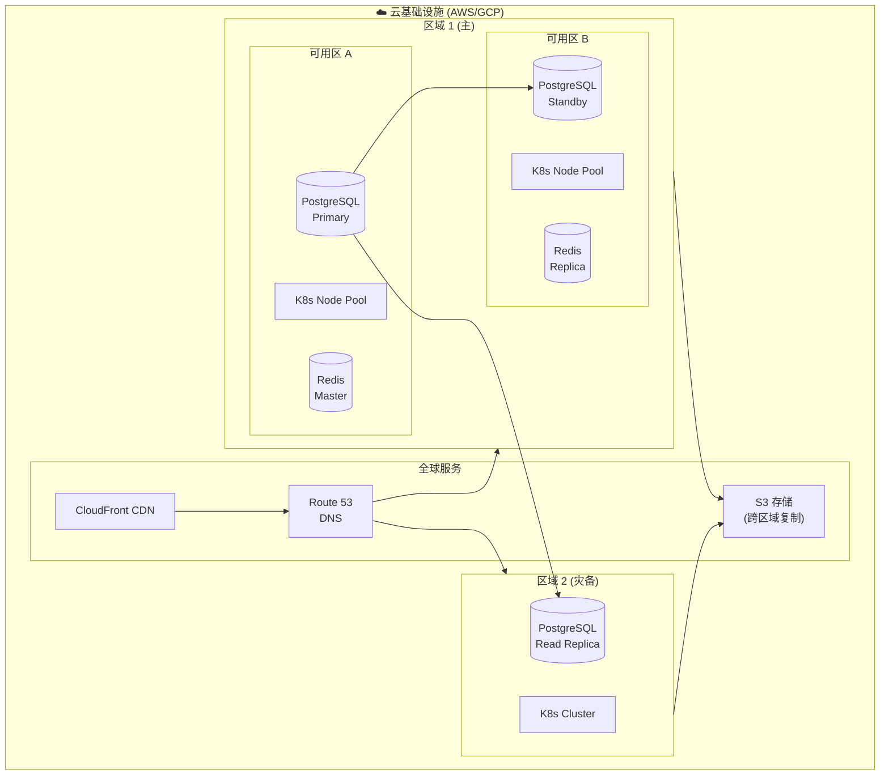

# 🏢 Lyric Sync 商业级架构设计文档

> **版本**: v2.0 Enterprise Edition  
> **适用场景**: 百万级用户、高并发、分布式部署

---

## 📋 目录

1. [技术栈架构图](#-技术栈架构图)
2. [项目目录结构](#-项目目录结构)
3. [核心业务流程图](#-核心业务流程图)
4. [数据库设计](#-数据库设计)
5. [安全架构](#-安全架构)
6. [部署架构](#-部署架构)

---

## 🧱 技术栈架构图

### 整体技术架构



### 技术选型详解

| 层级            | 技术                   | 选型理由                      | 替代方案                 |
| :-------------- | :--------------------- | :---------------------------- | :----------------------- |
| **前端框架**    | Next.js 14             | SSR/SSG、App Router、内置优化 | Nuxt.js, Remix           |
| **移动端**      | React Native / Flutter | 跨平台、代码复用率高          | 原生开发                 |
| **API Gateway** | Kong                   | 插件丰富、性能优秀            | AWS API Gateway, Traefik |
| **主数据库**    | PostgreSQL             | ACID、JSON支持、扩展性强      | MySQL, CockroachDB       |
| **缓存**        | Redis Cluster          | 高性能、数据结构丰富          | Memcached, KeyDB         |
| **搜索引擎**    | Elasticsearch          | 全文搜索、分析能力强          | Meilisearch, Algolia     |
| **对象存储**    | AWS S3                 | 无限扩展、高可用              | MinIO, Cloudflare R2     |
| **消息队列**    | Kafka                  | 高吞吐、持久化                | RabbitMQ, Pulsar         |
| **容器编排**    | Kubernetes             | 自动扩缩容、服务发现          | Docker Swarm, Nomad      |

### 前端技术栈详情



---

## 📁 项目目录结构

### Monorepo 架构

```
lyric-sync-enterprise/
├── 📂 apps/                          # 应用层
│   ├── 📂 web/                       # Web 应用 (Next.js)
│   │   ├── 📂 app/                   # App Router
│   │   │   ├── 📂 (auth)/            # 认证路由组
│   │   │   │   ├── login/
│   │   │   │   ├── register/
│   │   │   │   └── forgot-password/
│   │   │   ├── 📂 (dashboard)/       # 仪表盘路由组
│   │   │   │   ├── library/
│   │   │   │   ├── playlists/
│   │   │   │   └── settings/
│   │   │   ├── 📂 player/[id]/       # 播放器页面
│   │   │   ├── 📂 api/               # API 路由
│   │   │   │   ├── 📂 v1/            # API 版本控制
│   │   │   │   │   ├── auth/
│   │   │   │   │   ├── songs/
│   │   │   │   │   ├── playlists/
│   │   │   │   │   └── users/
│   │   │   │   └── 📂 webhooks/      # 第三方回调
│   │   │   ├── layout.tsx
│   │   │   └── page.tsx
│   │   ├── 📂 components/            # 页面组件
│   │   ├── 📂 hooks/                 # 自定义 Hooks
│   │   ├── 📂 stores/                # 状态管理
│   │   └── 📂 styles/                # 样式文件
│   │
│   ├── 📂 mobile/                    # 移动应用 (React Native)
│   ├── 📂 desktop/                   # 桌面应用 (Electron)
│   └── 📂 admin/                     # 管理后台
│
├── 📂 packages/                      # 共享包
│   ├── 📂 ui/                        # UI 组件库
│   │   ├── 📂 components/
│   │   │   ├── Button/
│   │   │   ├── Modal/
│   │   │   ├── Player/
│   │   │   └── LyricsDisplay/
│   │   └── 📂 themes/
│   │
│   ├── 📂 core/                      # 核心业务逻辑
│   │   ├── 📂 lyrics-parser/         # 歌词解析引擎
│   │   ├── 📂 audio-sync/            # 音频同步算法
│   │   └── 📂 validators/            # 数据验证
│   │
│   ├── 📂 api-client/                # API 客户端 SDK
│   ├── 📂 database/                  # 数据库 Schema & Migrations
│   ├── 📂 config/                    # 共享配置
│   └── 📂 types/                     # TypeScript 类型定义
│
├── 📂 services/                      # 后端微服务
│   ├── 📂 auth-service/              # 认证服务 (Go/Rust)
│   ├── 📂 user-service/              # 用户服务 (Node.js)
│   ├── 📂 music-service/             # 音乐服务 (Node.js)
│   ├── 📂 lyrics-service/            # 歌词服务 (Python)
│   ├── 📂 search-service/            # 搜索服务 (Go)
│   ├── 📂 recommendation-service/    # 推荐服务 (Python)
│   └── 📂 notification-service/      # 通知服务 (Node.js)
│
├── 📂 infrastructure/                # 基础设施即代码
│   ├── 📂 terraform/                 # 云资源编排
│   ├── 📂 kubernetes/                # K8s 配置
│   │   ├── 📂 base/
│   │   ├── 📂 overlays/
│   │   │   ├── development/
│   │   │   ├── staging/
│   │   │   └── production/
│   │   └── 📂 charts/                # Helm Charts
│   └── 📂 docker/                    # Docker 配置
│
├── 📂 docs/                          # 文档
│   ├── 📂 api/                       # API 文档 (OpenAPI)
│   ├── 📂 architecture/              # 架构文档
│   └── 📂 guides/                    # 开发指南
│
├── 📂 scripts/                       # 脚本工具
├── 📂 tests/                         # 集成测试 & E2E
├── turbo.json                        # Turborepo 配置
├── pnpm-workspace.yaml               # pnpm 工作空间
└── docker-compose.yml                # 本地开发环境
```

### 目录职责说明



---

## 🔄 核心业务流程图

### 1. 用户认证流程 (OAuth 2.0 + JWT)



### 2. 音乐上传与处理流程



### 3. 歌词同步播放流程



### 4. 完整数据流架构



---

## 🗃️ 数据库设计

### 完整 ER 图



### 核心索引设计

```sql
-- 用户表索引
CREATE UNIQUE INDEX idx_users_email ON users(email);
CREATE UNIQUE INDEX idx_users_username ON users(username);
CREATE INDEX idx_users_status ON users(status) WHERE status != 'deleted';

-- 歌曲表索引
CREATE INDEX idx_songs_user_id ON songs(user_id);
CREATE INDEX idx_songs_status ON songs(status);
CREATE INDEX idx_songs_created_at ON songs(created_at DESC);
CREATE INDEX idx_songs_search ON songs USING GIN(search_vector);

-- 歌词表索引
CREATE UNIQUE INDEX idx_lyrics_song_id ON lyrics(song_id);

-- 播放历史索引 (时间分区)
CREATE INDEX idx_play_history_user_time ON play_history(user_id, played_at DESC);
CREATE INDEX idx_play_history_song_time ON play_history(song_id, played_at DESC);

-- 歌单歌曲索引
CREATE INDEX idx_playlist_songs_playlist ON playlist_songs(playlist_id, position);
CREATE UNIQUE INDEX idx_playlist_songs_unique ON playlist_songs(playlist_id, song_id);
```

### 分区策略

```sql
-- 播放历史表按月分区
CREATE TABLE play_history (
    id uuid PRIMARY KEY,
    user_id uuid NOT NULL,
    song_id uuid NOT NULL,
    played_at timestamp NOT NULL
) PARTITION BY RANGE (played_at);

-- 创建月度分区
CREATE TABLE play_history_2026_01 PARTITION OF play_history
    FOR VALUES FROM ('2026-01-01') TO ('2026-02-01');
CREATE TABLE play_history_2026_02 PARTITION OF play_history
    FOR VALUES FROM ('2026-02-01') TO ('2026-03-01');
```

---

## 🔐 安全架构



---

## 🚀 部署架构



---

## 📊 性能指标要求

| 指标               | 目标值   | 监控方式             |
| :----------------- | :------- | :------------------- |
| API 响应时间 (p99) | < 200ms  | Prometheus + Grafana |
| 页面加载时间 (LCP) | < 2.5s   | Web Vitals           |
| 可用性 (SLA)       | 99.95%   | StatusPage           |
| 并发用户数         | 100,000+ | Load Testing         |
| 音频流延迟         | < 100ms  | 实时监控             |
| 歌词同步精度       | ±50ms    | 用户反馈             |

---

> 📚 **相关文档**:
> - [API 设计规范](./API_SPECIFICATION.md)
> - [安全合规指南](./SECURITY_COMPLIANCE.md)
> - [运维手册](./OPERATIONS_GUIDE.md)
